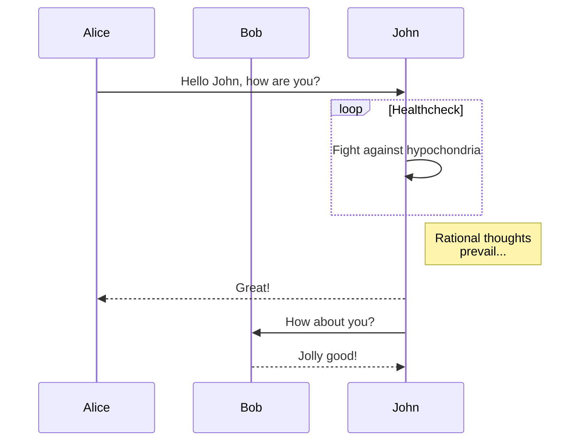
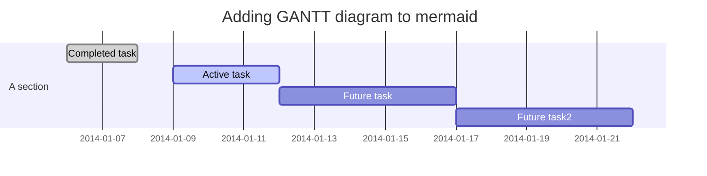
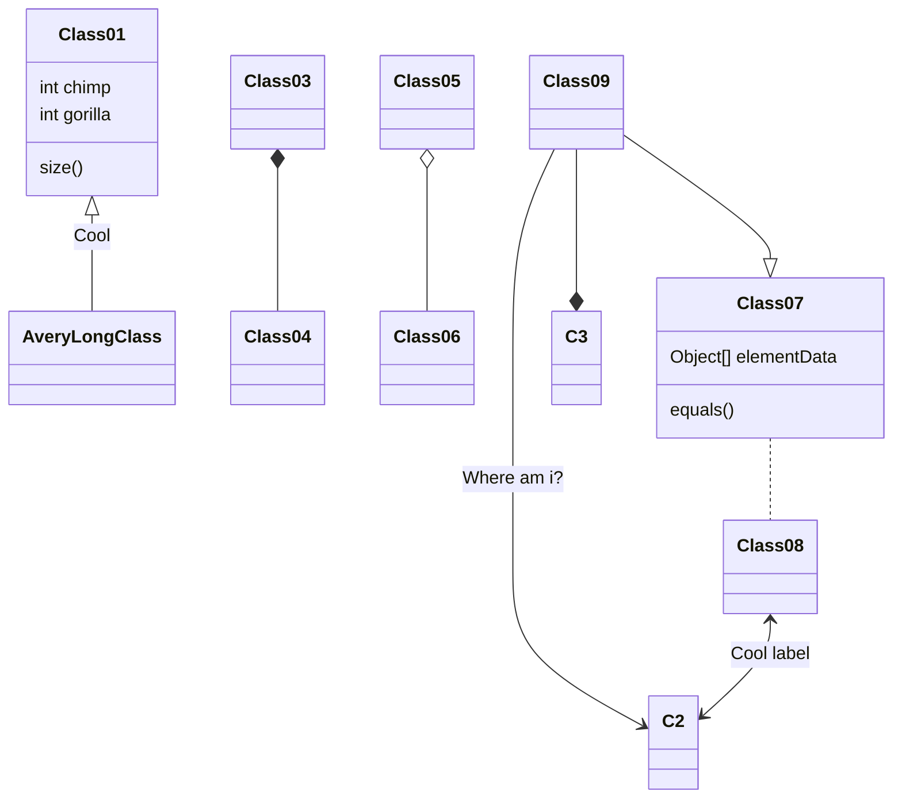

## 글 작성 가이드

사용할 수 있는 마크다운 문법 및 추가적인 플러그인 사용법에 관해서 기술

<!-- more -->

emphasis: `keyword`

highlight.js

```python
def fib(n):
    a, b = 0, 1
    while a < n:
        print(a, end=' ')
        a, b = b, a+b
    print()
fib(1000)
```

```go
type Map struct {
    mu Mutex
    read atomic.Value
    dirty map[interface{}]*entry
    misses int
}
```

## Table

| Header 1 | Header 2 | Header 3  |
| -------- | -------- | --------- |
| Key 1    | Value 1  | Comment 1 |
| Key 2    | Value 2  | Comment 2 |
| Key 3    | Value 3  | Comment 3 |

## H2

### H3

번호가 있는 목록

1. A
2. B
3. C

### H3

번호가 없는 목록

- A
- B
- C

## 이미지


## LaTex

$$
\Gamma _ { \epsilon } ( x ) = [ 1- e ^ { - 2\pi \epsilon } ] ^ { 1- x } \prod _ { n = 0} ^ { \infty } \frac { 1- \operatorname{exp} ( - 2\pi \epsilon ( n + 1) ) } { 1- \operatorname{exp} ( - 2\pi \epsilon ( x + n ) ) }
$$

$$
\left( \begin{array} c t ^ { \prime } \\ x ^ { \prime } \\ y ^ { \prime } \\ z ^ { \prime } \end{array} \right) = \left( \begin{array} { c c c c } { \gamma } & { - \gamma \beta } & { 0 } & { 0 } \\ { - \gamma \beta } & { \gamma } & { 0 } & { 0 } \\ { 0 } & { 0 } & { 1 } & { 0 } \\ { 0 } & { 0 } & { 0 } & { 1 } \end{array} \right) \left( \begin{array} c t \\ x \\ y \\ z \end{array} \right)
$$

$$
6 \mathrm { CO } _ { 2 } + 6 \mathrm { H } _ { 2 } \mathrm { O } \rightarrow \mathrm { C } _ { 6 } \mathrm { H } _ { 12 } \mathrm { O } _ { 6 } + 6 \mathrm { O } _ { 2 }
$$

## mermaid flowchart







### note


Info `markdown`



Warning `markdown`



etc `markdown`


### label

  

### checkbox




### js



### 이미지 분할






### 참조

나무위키 태그[^1]：

나무위키 태그[^2]。

[^1]: 수장형이 좋아할듯
[^2]: 맞지?
